**I have learned in the database fundamentals course how to create tables, insert data into them, modify the data and delete or drop the table. Additionally, I have learned how to retrieve data from databases,
including retrieving all data, specific data based on certain conditions, or data in a specific order.**

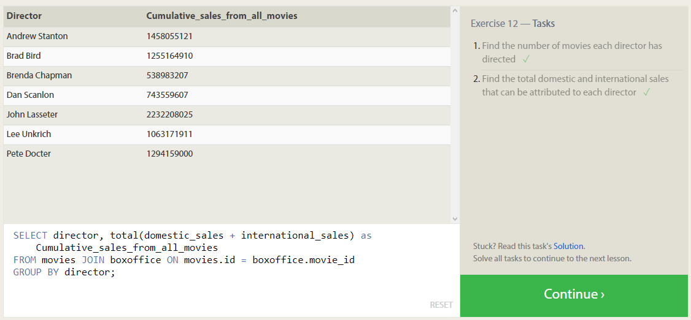
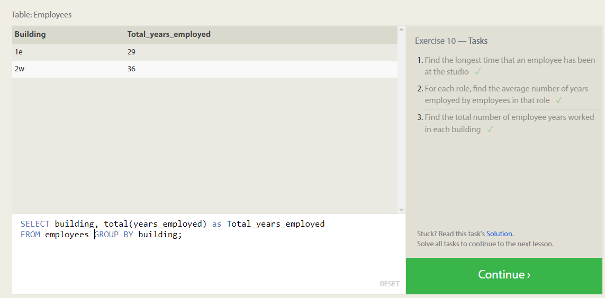
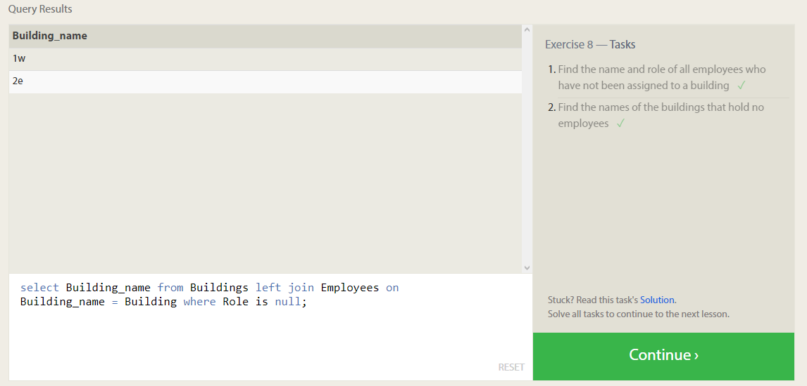
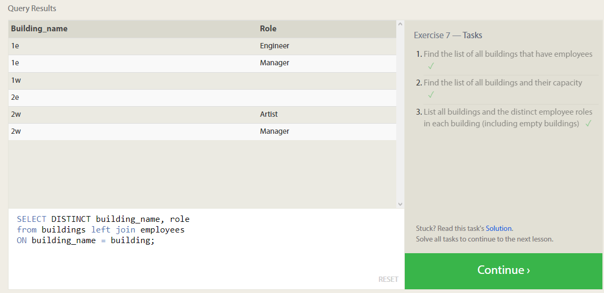
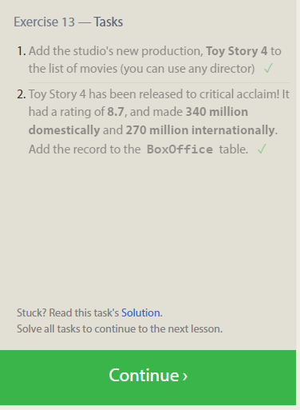
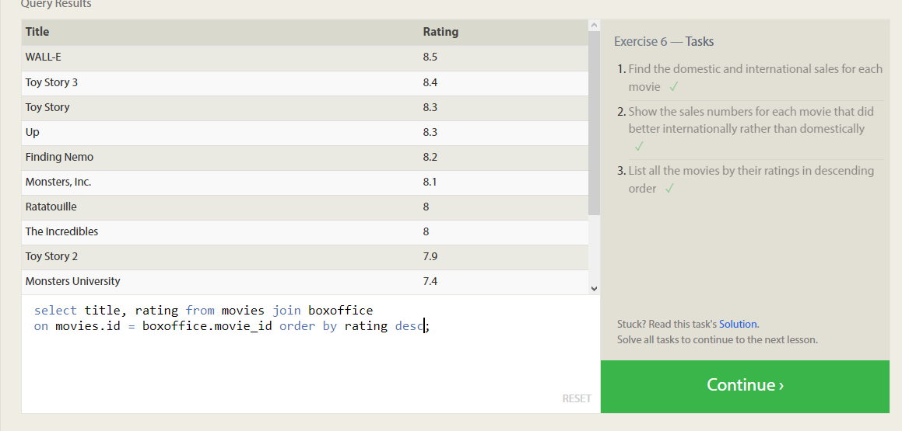
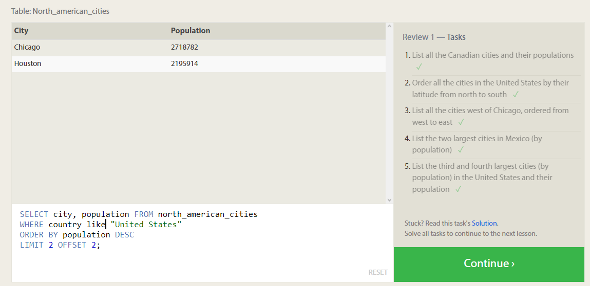
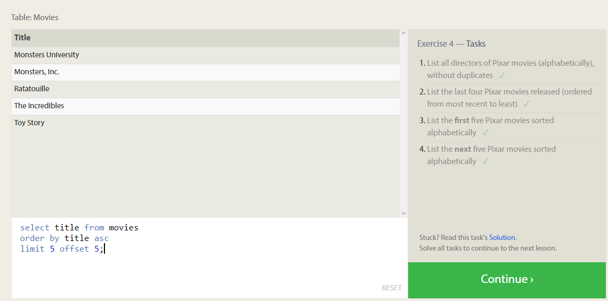
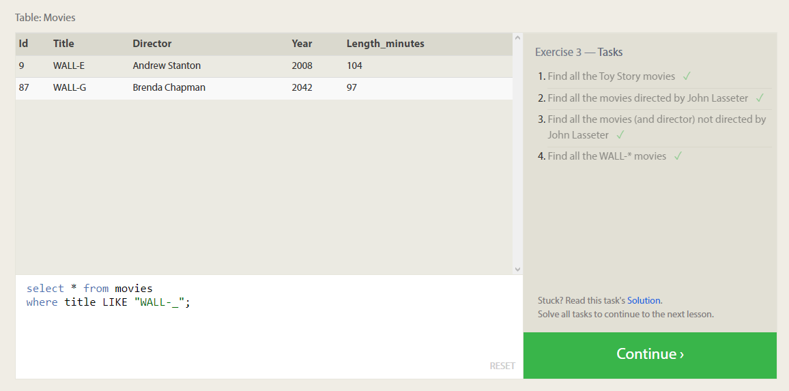
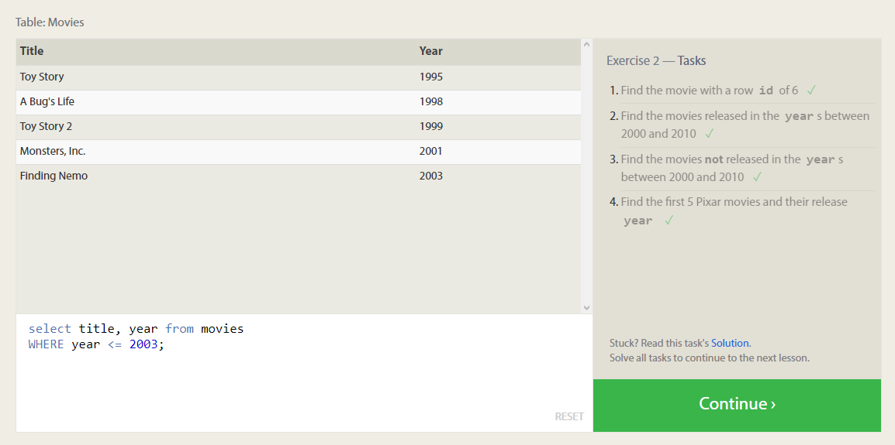
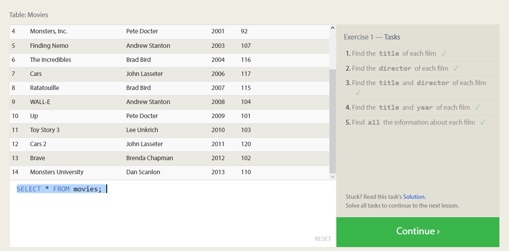
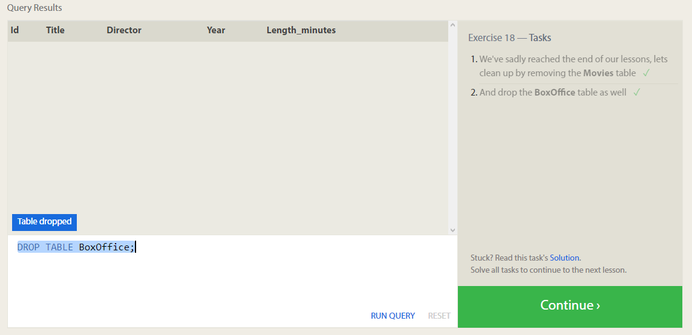
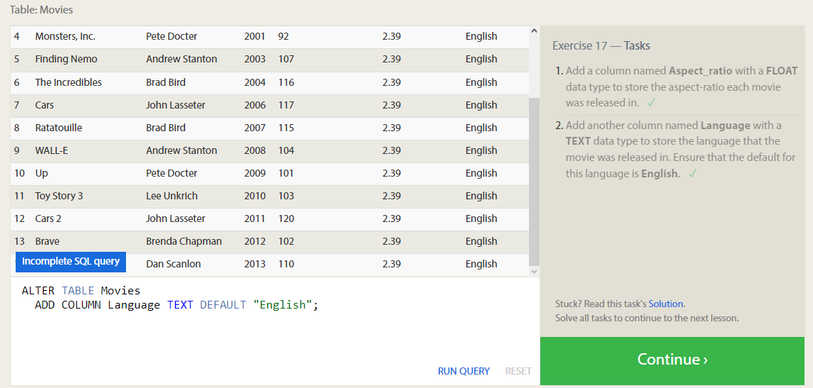
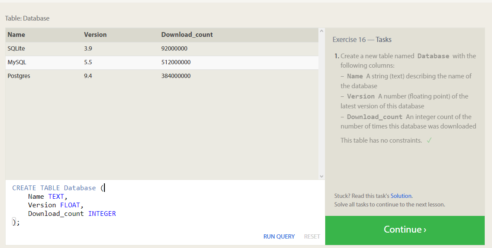
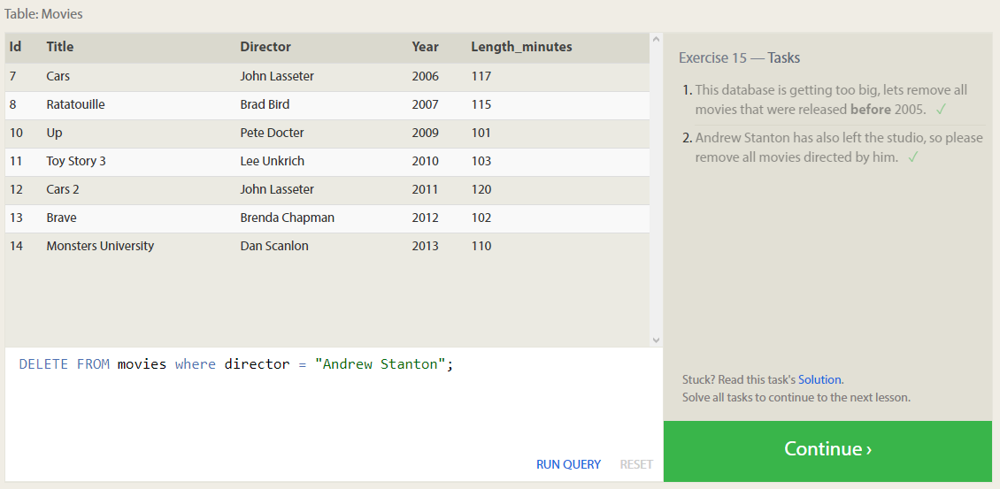
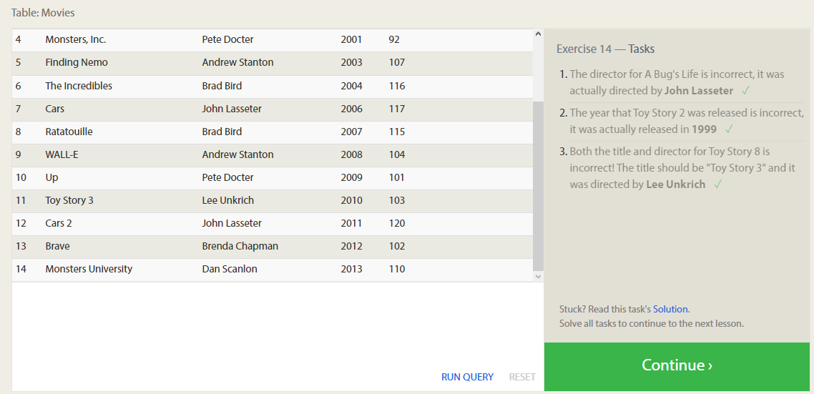

